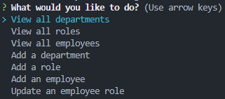

# Employee Data Tracker

## Table of Contents
- [Description](#description)
- [Installation](#installation)
- [Usage](#usage)
- [Credits](#credits)
- [License](#license)
 

## Description
This is an application used to track Employee data within a company, such as their Role, Department, Salary and Manager. This application allows functionality to create and remove new Roles, Departments and Employees as well as updating the information of current Employees.
 

## Installation
Clone the repository and ensure you have node.js installed.  
Once you've done that, open the terminal and run `npm install` to install the dependencies.
 

## Usage
[Link to video walkthrough]()  

Run the `node index.js` command to be shown a series of prompts.  
These prompts will show a few options that the user can select, as seen in the image below.  

 

The user will then be able to view the current Departments, Roles and Employees of the company as well as updating these values. The user may also create new Departments, Roles and add new Employees at will.  

## Credits
Daler Singh  
Sachin Jhaveri  
[NPMjs - console.table](https://www.npmjs.com/package/console.table)  
[NPMjs - inquirer](https://www.npmjs.com/package/inquirer/v/8.2.4)  
[NPMjs - mysql2](https://www.npmjs.com/package/mysql2)  

## License
The code in this project is licensed under MIT license.